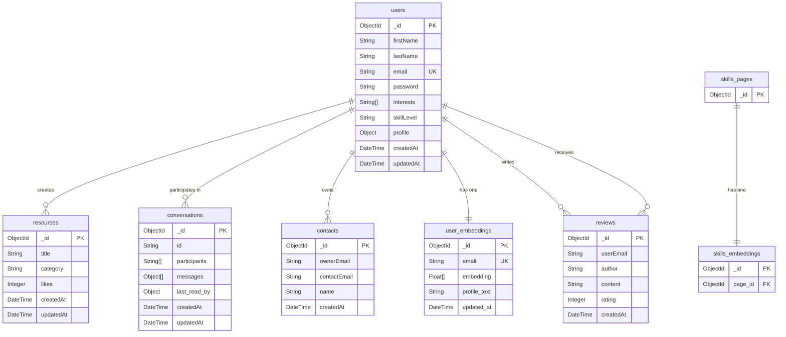

# SkillSphere README

## Module Information
- **Module Code:** COM4113
- **Module Title:** Tech Stack
- **Institution:** Leeds Trinity University

## Project Overview
SkillSphere is a full-stack web application designed to facilitate skill and information sharing within a community. It allows users to browse resources, register for an account, manage a personal profile, and interact with other users and content.

This project demonstrates a complete MERN-like stack (MongoDB, Express/Flask, React, Node.js), integrating a responsive React frontend with a robust Python Flask backend. The application handles user authentication, data persistence, and real-time interactions, showcasing a scalable and maintainable architecture.

## The Choice of Tech Stack

### Frontend
-   **React:** Chosen for its component-based architecture, which promotes reusability and maintainability. Its vast ecosystem and strong community support make it an industry standard for building dynamic user interfaces.
-   **Vite:** Selected as the build tool for its exceptional speed and developer-friendly experience, offering near-instant Hot Module Replacement (HMR).
-   **Tailwind CSS:** Used for its utility-first approach, allowing for rapid and consistent UI development without leaving the HTML.

### Backend
-   **Flask:** This Python micro-framework was chosen for its simplicity, flexibility, and lightweight nature. Compared to a more opinionated framework like Django, Flask provides the freedom to select libraries and design the application structure from the ground up, which was ideal for this project's specific scope. Its "micro" nature does not limit its capabilities but rather provides a solid foundation that is easy to extend, as demonstrated by the integration of libraries for database access, authentication, and real-time communication.
-   **MongoDB:** A NoSQL database selected for its flexible, document-based data model. This allows for easy storage and retrieval of semi-structured data like user profiles and resources, which can evolve without requiring rigid schema migrations.

## Installation and Setup
To run this project locally, you will need to set up the frontend and backend services separately.

### Frontend Setup
1.  Navigate to the root directory and open a terminal (like PowerShell).
2.  Install the required Node.js dependencies:
    ```powershell
    npm install
    ```
3.  Start the Vite development server:
    ```powershell
    npm run dev
    ```
4.  The frontend will be available at the local address displayed in your terminal (usually `http://localhost:5173`).

### Backend Setup
1.  Navigate to the `backend` directory:
    ```powershell
    cd backend
    ```
2.  Create and activate a Python virtual environment. The command below is for PowerShell on Windows:
    ```powershell
    python -m venv venv
    .\\venv\\Scripts\\activate
    ```
3.  Install the required Python packages from `requirements.txt`:
    ```powershell
    pip install -r requirements.txt
    ```
4.  Create a `.env` file in the `backend` directory. This step is recommended for securely managing credentials. While the application has a default MongoDB connection string, you can override it here. You also need to add your Voyage AI API key.
    ```
    # Optional: Override the default MongoDB connection string
    # MONGO_URI="your_mongodb_connection_string_here"

    # Required for AI features
    VOYAGE_API_KEY="your_voyage_ai_api_key_here"
    ```
5.  Start the Flask development server:
    ```powershell
    python app.py
    ```
6.  The backend API will be running on `http://127.0.0.1:5000`.

## Project Architecture

### Database Schema
The application uses MongoDB to persist data across several collections:

-   **`users`**: Stores user information, including profile data, credentials, and interests.
-   **`resources`**: Stores learning resources, which can be liked and categorized.
-   **`conversations`**: Stores messages between users.
-   **`contacts`**: Stores user's contacts.
-   **`user_embeddings`**: Stores Voyage AI embeddings for user profiles to enable similarity searches.
-   **`reviews`**: Stores reviews and ratings that users give to each other.
-   **`skills_pages`**: Stores information about skill pages.
-   **`skills_embeddings`**: Stores Voyage AI embeddings for skills pages.

### Database Diagram



### Legal, Ethical, and Risk Considerations
-   **GDPR & Data Protection:** The application handles user data such as emails and passwords. All passwords are encrypted in the database using the `werkzeug.security` library for hashing and salting, ensuring they are not stored in plaintext. This aligns with data protection best practices.
-   **Ethical Trade-offs:** The platform's open nature requires content moderation to prevent abuse. Future iterations would include reporting and moderation tools to maintain a safe and trustworthy environment.
-   **Risk Assessment:** The primary risks, such as data integrity and unauthorized access, are mitigated through server-side validation and a secure authentication system.

### Reflection on Challenges
-   **CORS Management:** A key challenge was configuring Cross-Origin Resource Sharing (CORS) between the React frontend (on port 5173) and the Flask backend (on port 5000). This was solved by using the `Flask-Cors` extension to create a whitelist, allowing secure communication between the two services.
-   **State Management:** Managing user authentication state across the full stack required careful planning. The solution involved using context in React to hold the user's session state and ensuring the backend securely validated requests.
-   **Data Modeling:** Designing the NoSQL schema to be efficient required consideration of how data would be queried. For instance, embedding some data and referencing other documents was a key decision point.

### In-Code Documentation
The codebase is commented to improve clarity and maintainability. Flask routes and helper functions include docstrings explaining their purpose, expected parameters, and return values. On the frontend, React components are commented to describe their props and state.

### AI Usage Declaration
Generative AI techniques were used to review documentation and code for clarity, layout, and error checking. All application code and documentation were authored by the developer, with AI used solely for review and refinement.

### References

AuditBoard. (2025). The GDPR compliance framework: What you need to know in 2025. Retrieved from https://auditboard.com/blog/gdpr-compliance-framework

DigitalOcean. (2025, May 14). How To Set Up a React Project with Vite for Fast Development. Retrieved from https://www.digitalocean.com/community/tutorials/how-to-set-up-a-react-project-with-vite

DEV Community. (2024, August 10). React + Vite: why use? Retrieved from https://dev.to/doccaio/react-vite-why-use-cg2

European Commission. (2025). Data protection - European Commission. Retrieved from https://commission.europa.eu/law/law-topic/data-protection_en

GDPR Local. (2025). GDPR compliance for apps: A 2025 guide. Retrieved from https://gdprlocal.com/gdpr-compliance-for-apps/

GitLab. (2025). What are Git version control best practices? Retrieved from https://about.gitlab.com/topics/version-control/version-control-best-practices/

Mike Codeur. (2024, December 13). Getting Started with React and Vite: The Complete Guide. Retrieved from https://blog.mikecodeur.com/en/post/getting-started-with-react-and-vite-the-complete-guide

Nerdify Blog. (2025). 8 essential version control best practices for 2025. Retrieved from https://getnerdify.com/blog/version-control-best-practices/

TatvaSoft Blog. (2024, July). Vite vs Create-React-App: A Detailed Comparison. Retrieved from https://www.tatvasoft.com/outsourcing/2024/07/vite-vs-create-react-app.html

Zemith. (2025). 8 version control best practices for teams in 2025. Retrieved from https://www.zemith.com/en/blogs/version-control-best-practices/
