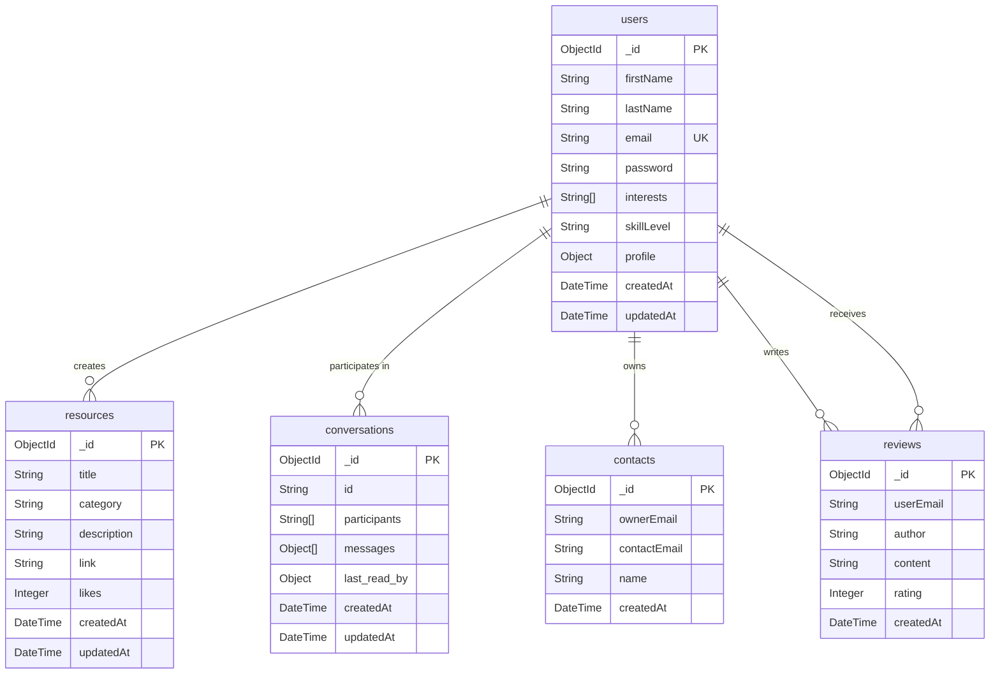

# Entity Relationship Diagram (ERD) - SkillSphere

This diagram models the MongoDB document structure and relationships within the SkillSphere platform.

### Collection Summaries:

1.  users: Stores core account details and hashed passwords. The `profile` object contains nested bio and image path data.
2.  resources: Community-shared links and tutorials, categorized for easy discovery.
3.  conversations: Manages real-time message history between users with embedded message arrays for high read performance.
4.  contacts: User-specific address book for messaging.
5.  reviews: Dynamic feedback and ratings provided by users for one another.
