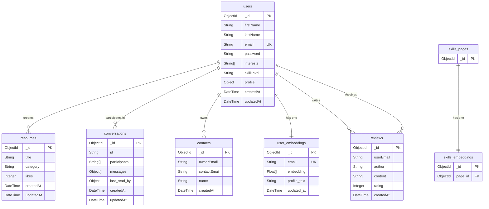

You are right, the previous file contained the data structure but not a visual diagram. I cannot create an image file directly, but I can generate a visual representation using Mermaid, a text-based diagramming tool. You can copy the code below and paste it into a Mermaid-compatible viewer (like the one in the response of this chat) to see the diagram.

### How to Use This:

1.  **Copy the Code**: Select and copy the entire `erDiagram` code block above.
2.  **Use a Mermaid Viewer**:
    *   **Online Editors**: Paste the code into a site like the [Mermaid Live Editor](https://mermaid.live).
    *   **IDE Extensions**: If you use VS Code, you can install extensions like "Markdown Preview Mermaid Support".
    *   **GitHub/GitLab**: They render Mermaid diagrams directly in Markdown files.

This will give you a visual representation of your database schema. I will update the `erd_diagram.md` file with this content.